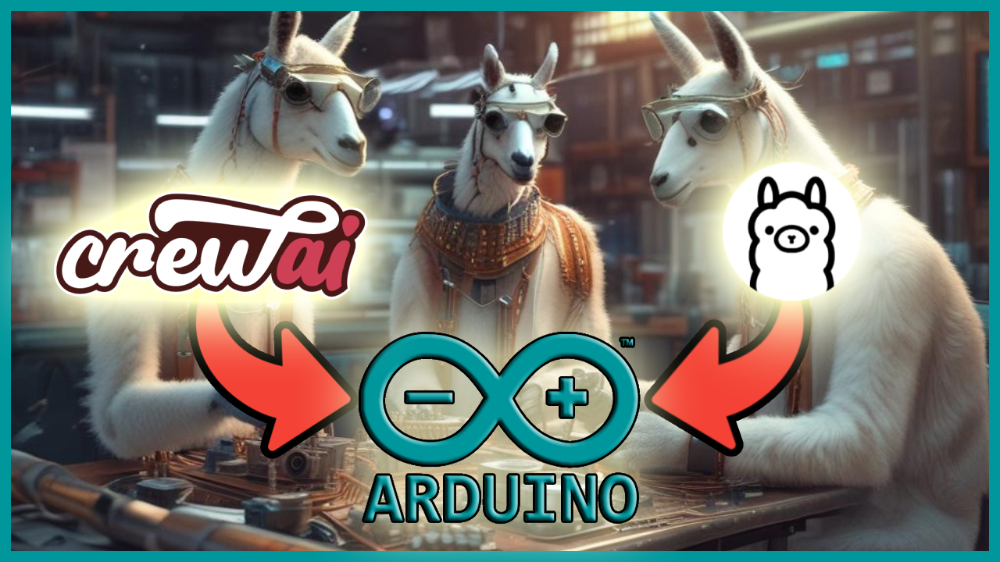

<p align="center">
    
    <h1 align="center">When CrewAI meets Arduino</h1>
    <h3 align="center">CrewAI + Llama3 + Ollama team up to program my Arduino UNO</h3>
</p>

---

## Description

A funny project where we'll connecting [crewAI] with an Arduino. The final
crew consists of [two agents](agents.py).

1️⃣ Sketch Programmer Agent

It receives a circuit description and its expected behaviour (e.g. light on and off a LED repeatedly) generating, 
in return, a sketch file (the script containing the code for sending instructions to Arduino).

2️⃣ Web Researcher

Takes the generated sketch file, compiles it and uploads the instructions into the Arduino. To achieve its goal, this agent uses a [custom tool](tools%2Farduino.py)
for the compilation and uploading.
  
  
<p align="center">
    
</p>


## Usage

There are a couple of prerequisites for running this project:

1️⃣ Arduino board

Since this project seeks to connect crewAI and Arduino ... you should 
have an Arduino 😅. In my case I was using an [Arduino UNO](https://store.arduino.cc/products/arduino-uno-rev3).

2️⃣ Arduino CLI

Apart from the Arduino board, you'll also need to install the Arduino CLI. This is 
the CLI used by the custom tool for compiling and uploading the instructions to the Arduino.

Check the installation guide [here](https://arduino.github.io/arduino-cli/0.35/installation/).

3️⃣ Project dependencies

Finally, you need to install the project dependencies defined in the
requirements file.

```
pip install -r requirements.txt
```

And, to run the kickoff the crew.

```
python main.py
```
